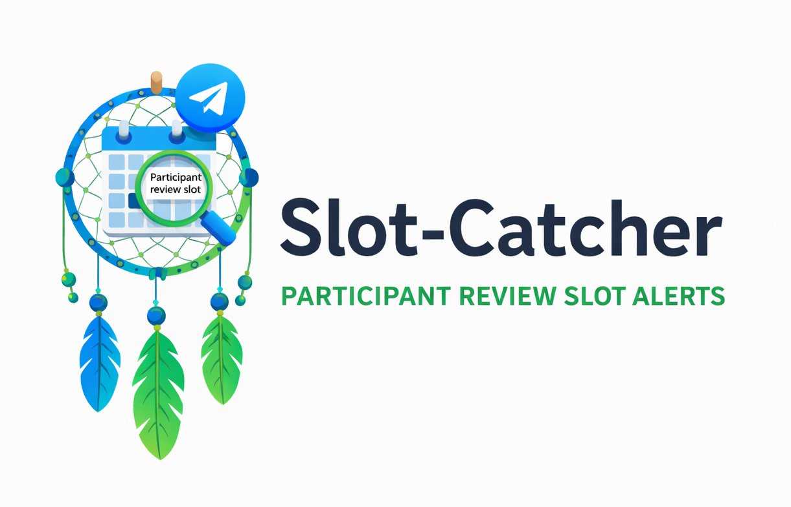

<p align="center">
  
</p>


# Slot-Catcher 🎯 

**Slot-Catcher** is a pet project designed to automate monitoring of available project review slots on the **School 21** educational platform.

Instead of manually refreshing the project review calendar over and over again, this Python script periodically checks for free slots and **notifies you via Telegram** as soon as new ones appear.

The project includes a **Dockerfile** that builds a ready-to-use container with all required dependencies (Python, Selenium, Chrome, ChromeDriver).

---

## Features ✨

- Automated monitoring of project review slots
- Periodic calendar checks with a configurable interval
- Telegram notifications when slots appear
- Fully containerized with Docker
- Initial notification on startup (even if no slots are found)
- Notifications only for **new** slots afterward

---

## How It Works ⚙️

1. The script logs into the School 21 platform.
2. It opens the project review calendar page.
3. At a fixed interval, it checks for available review slots.
4. When free slots are found, a Telegram message is sent to the student.
5. The script keeps running until manually stopped.

---

## Requirements 📦

- Docker
- Telegram bot token and your Telegram user ID
- School 21 platform account (without 2FA)

> ⚠️ **Note:** Accounts with enabled two-factor authentication (2FA), such as volunteer accounts, are **not supported** at the moment.

---

## Configuration 🔧

Before building the Docker image, you **must** update the `config.txt` file with your own data.

### `config.txt` example

```txt
USERNAME=login
PASSWORD=password
PAGE_LOAD_WAIT=30
CHECK_INTERVAL=180
BOT_TOKEN=5453675132:AbHjdvlJgI8IfkdlqaCzXhfg5su4YVrZdrw
USER_ID=6435621344
````

### Configuration parameters

* `USERNAME` – your School 21 login
* `PASSWORD` – your School 21 password
* `PAGE_LOAD_WAIT` – wait time (in seconds) for slots loading
* `CHECK_INTERVAL` – how often the calendar is checked (in seconds)
* `BOT_TOKEN` – Telegram bot token from @BotFather, don't forget to write /start to the bot
* `USER_ID` – your Telegram chat id (can be obtained with @userinfobot)

---

## Time Zone Configuration 🕒

The Docker container is configured to use the **Europe/Moscow** time zone by default.

In the `Dockerfile` you will find:

```dockerfile
RUN ln -sf /usr/share/zoneinfo/Europe/Moscow /etc/localtime \
    && echo "Europe/Moscow" > /etc/timezone \
    && dpkg-reconfigure -f noninteractive tzdata
```

If you are in a different time zone, **change it manually** in the `Dockerfile` **before building the image**.

---

## 🐳 Docker Setup

### Install Docker on Ubuntu

```bash
sudo apt update && sudo apt install docker.io -y
```

---

## Build and Run 🚀

After configuring `config.txt` and (optionally) the time zone:

### Build the Docker image

```bash
sudo docker build -t slot-catcher .
```

### Run the container

```bash
sudo docker run -it slot-catcher
```

---

## Project ID Input 🆔

After startup, the script will ask you to enter the **Project ID**.

You can find it in your browser’s address bar on the project page.

Example:

```
https://platform.21-school.ru/project/71963/about
```

In this case, the project ID is:

```
71963
```

Enter this number when prompted.

---

## Notifications 📲

* On successful startup, the script **always sends an initial Telegram notification** with the currently found slots (even if none are available).
* After that, notifications are sent **only when new slots appear**.

---

## Stopping the Script 🛑

To stop the script, press:

```
Ctrl + C
```

inside the running Docker container terminal.

---

## Current Limitations ⚠️

* Two-factor authentication (2FA) is **not supported**
* Only slots for the **current week** are checked
* Only the **start time** of a slot is detected
* Not yet tested with group projects review slots
* Early development stage — the code is functional but not yet fully polished

---


## Disclaimer 📌

This project is intended for **educational and personal use only**.
Use it responsibly and at your own risk.

---

Happy catching slots! 🎉
